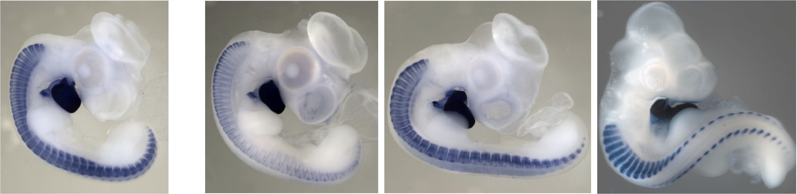
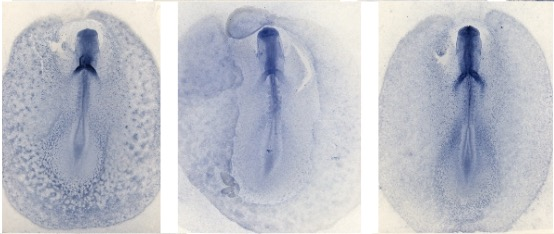

 # GEISHA-Image-Search

Improved image search for [Geisha](http://geisha.arizona.edu/geisha/), an online repository for gene expression in chicken embryos.



**Table of Contents**

* [Overview](#overview)
* [Usage](#usage)
* [Problem](#problem)
* [Solution Concept](#solution-concept)

##  Overview

This project creates an image search engine for images within the [Geisha](http://geisha.arizona.edu/geisha/) database. It allows for search of embryo images based on an input embryo, which can yield quicker and more accurate results than querying based on manually specified parameters. With GEISHA Image Search, scientists and students can easily find and compare images based on similarity.

An input embryo can be from any source, including:
- From within the Geisha database
- From another database or publication
- Created via drawing, in which a user artifically creates staining patterns on a blank embryo (currently in development)

Given this input, Geisha Image Search will find and return the most "similar" Geisha images (more on the definition of similarity below).

For usage information, read [directly below](#usage). For more information about the purpose and methodology of this project, read the [sections](#problem) further below.

## Usage

This image search engine has been integrated in the [Geisha](http://geisha.arizona.edu/) website. It is recommended to use this search engine via the website tool.

It can also be deployed locally via [Flask](https://github.com/pallets/flask) as a python web app. Running it requires the following **dependencies**:

* python 3+
* Flask==1.1.1
* [fastai](https://github.com/fastai/fastai)==1.0.61

When deployed, the web app accepts an input image, and then searches and returns similar images in the Geisha database. It accepts two parameters, which are given as query parameters in the app's url:

- `filename` (required): the filename of an image to find similar images to. This can be a path to a local image file (absolute or relative to this repository), or the filename of an image on the [Geisha](http://geisha.arizona.edu/) website (upon which it will be downloaded directly). Anything else will result in an error.
- `num_images`: the number of similar images to return. The default is 50.

A sorted list of the most similar image filenames are returned, separated by newline characters. On a browser, this will display as a list of filenames separated by spaces.

The web app is located at `src/image-search-flask.py`. Run it from the **main directory**, and optionally specify the port (defaults to 8081):

```bash
python src/image-search-flask.py <port number>
```

Then, visit `localhost:<port number>`, and specify the filename and number of images (optionally) via query parameters.

### Example Usage:
**Input link:** [localhost:8081/?filename=R449.CDH5.S17.001.jpg&n=10]()

**Displayed Output (may be separated by spaces instead):**
```
R449.CDH5.S17.001.jpg
R449.CDH5.S16.001.jpg
R361.EGFL7.S17D.004.jpg
R467.CDH5.S14002.jpg
...
```

The images can then be found on the Geisha website by appending the filename to this link: http://geisha.arizona.edu/geisha/photos/ + \<filename\>

### Example images:

This repository contains several examples of the image search engine's results, located in `data/example-images`. Each folder contains 11 images: an example input, with 10 output embryos in order of similarity. The input embryo is denoted by "Input." in its filename, while the rest are denoted by numbers in their filenames. 


## Problem

[GEISHA](http://geisha.arizona.edu/geisha/), a [National Institutes of Health](https://www.nih.gov/) funded project, investigates gene expression patterns in chicken embryos using whole mount *in situ* hybridization, and then provides images of those expression patterns through an online database. By doing so, it is a valuable resource for researchers and students of developmental biology. However, the embryo images in Geisha can be numerous and difficult to find. Existing methods of querying and filtering embryos are primarily limited to filtering by **stage** (the age the embryo in development) and **anatomical location** (the areas marked by blue staining in which a gene is expressed). This information has to be manually provided, and are unspecific– thousands of images can correspond to a certain stage or stained location. To address these problems, this project creates an image search engine, in which embryo images can be used to find other images.

With Geisha Image Search, a researcher or student can input a picture of an embyro, and then search for similar embryos. The definition of similarity can be found [below](#the-criteria-for-similarity). By allowing search though existing images rather than through technical parameters, students  and researchers have a quick and effective way to find embryos of a certain category. This is especially relevant for students, who may not have a full understanding of staining or requisite terminology.

For example, a scientist might come across the embryo on the left:


Previously, to find similar images, he/she would have to identify the stage of the embryo and the areas with blue staining, then query and sift through all the results. This is time consuming and difficult for students. With Geisha Image Search, he/she could simply save and upload the image, and receive these the 3 images above and to the right in return. Finding images of such visual similarity would take much more time and effort with manual methods.

With this mechanism, searching for gene expression in the Geisha database is made more simple, effective, and flexible.  

### The Criteria for Similarity

For each image, there are two features that distinguish it from others: the stage of embryo development and the anatomical locations (the location of patches stained blue, denoting gene expression). These features determine the similarity of an embryo compared to another.

1. **Stage:** refers to how far the chicken embryo is in development. Here are three embryos in a similar stage.



2. **Location:** refers to where genes are expressed in the embryo, indicated by blue staining. Locations are predetermined parts of an embryo in which staining can occur (see the Geisha website for a full list). The example with 4 embryos show common expression in the "heart" and "somites" locations.

When comparing images, embryos in similar stages, with staining in similar areas, will be considered more similar.

## Solution Concept

This solution uses deep learning to compare and query images.

As defined above, the two relevant features of an embryo image are its stage and staining in anatomical locations. Thus, any search or comparison must take these features into account. To do so without manual specification (which represents the previous method of search), GEISHA Image Search utilizes deep learning to automatically extract the stage and anatomical locations of input images.

Specifically, two deep learning models (or networks) are trained using the entire Geisha database to predict the stage and location information for a given embryo image. These prediction models, after being exposed to a signifcant amount of embryos, are able to accurately determine the stage and stained locations of new embryos, including ones from other databases or those with staining artificially drawn.

The solution framework is below. Upon receiving an input embryo image, the trained models determine the embryo's stage and the locations in which expression is observed. With this information, the embryo is compared with all the other embryos in the database. The embryos within Geisha are ranked by similarity with the input embryo and returned to the user.


Project Organization
------------

    ├── LICENSE
    ├── README.md          
    ├── data
    │   ├── database-image-predictions.pkl  <- Saved predictions on images in the database
    │   │
    │   └── example-images <- Example input embryos and search results
    │
    ├── models             <- Trained deep learning models used to predict an embryo's stage and stained anatomical locations
    │
    ├── requirements.txt   <- Python requirements to run locally
    │
    ├── src            
    │   ├── image-search-flask.py  <- The live web app that runs image search
    │   │
    │   ├── search.py      <- Dependencies to run the search engine
    │   │
    │   ├── update-data.py <- A script to update this repository's data as new embryo images are created
    │   │
    │   └── last-updated,data-updates-log <- Logs to keep track of when images are updated
    │
    └── img                <- Images for github


--------

<p><small>Project based on the <a target="_blank" href="https://drivendata.github.io/cookiecutter-data-science/">cookiecutter data science project template</a>. #cookiecutterdatascience</small></p>
