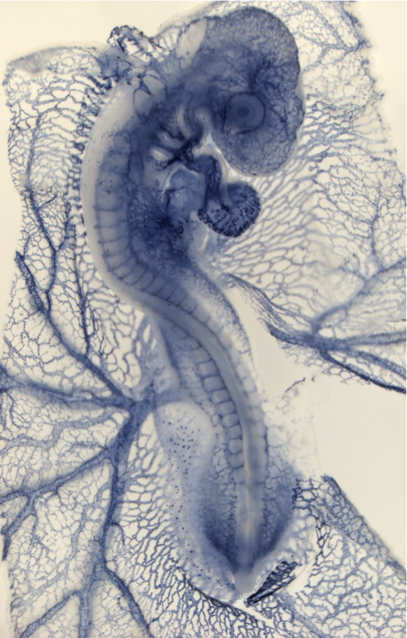
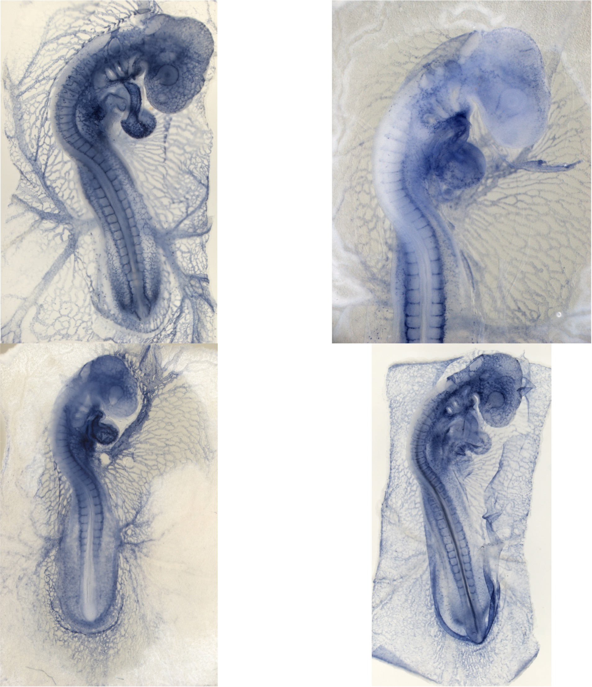
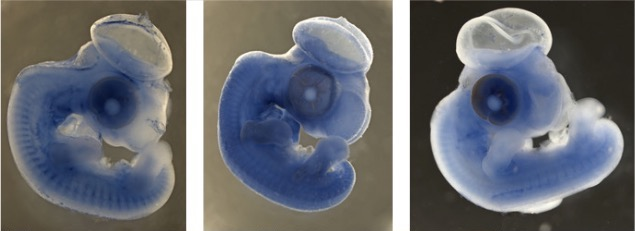
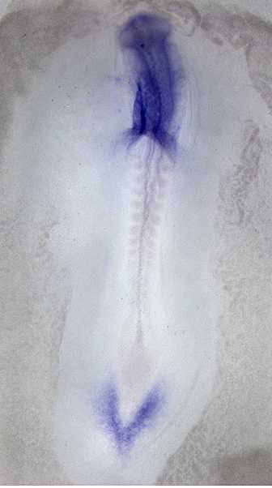
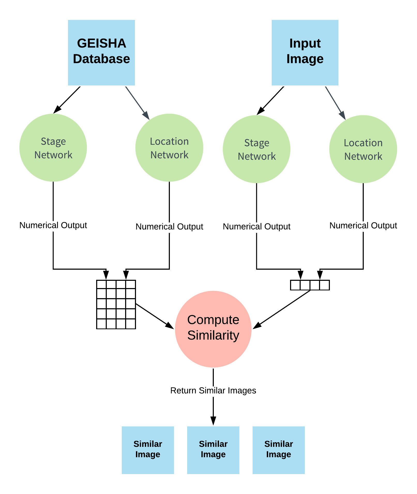

# GEISHA-Image-Search

Image search for [GEISHA](http://geisha.arizona.edu/geisha/), an online repository for gene expression in chicken embryos.

## Problem

[GEISHA](http://geisha.arizona.edu/geisha/), a [National Institutes of Health](https://www.nih.gov/) funded project, investigates gene expression patterns in chicken embryos using situ hybridization and provides images of chicken embryos in an online database. By doing so, it is a valuable resource for researchers and students of developmental biology. However, with an abundance of embryo images comes difficulty making sense of all the images, and the existing methods of querying and filtering embryos can be esoteric and time-consuming. These methods are mostly limited to filtering by stage and anatomical location (the blue area in which a gene is expressed), and they pose the problems of being difficult for students to understand, and returning up to thousands of images for common categories (one anatomical location returns over 6000 results). To address these problems, this project introduces a new way: using an image to search for other images.

With Geisha Image Search, a researcher or student could find new images by inputting one of their own, and getting out images of similar embryos. Using an embryo image from the [GEISHA](http://geisha.arizona.edu/geisha/) website or another lab or publication, he/she is able to find similar images to compare or learn from. This way, students are able to browse images without a full understanding of their terminology or science, and researchers, especially those who use comparable images in their research, have a way to quickly search through thousands of photos and obtain the ones relevant to them.

For example, a scientist in his research might come across this image:

Without Geisha Image Search, if the scientist wanted to find other embyros like it, he/she would have to identify the features of that image and query them, or scroll through the [GEISHA](http://geisha.arizona.edu/geisha/) database in hopes of finding others like it. With Geisha Image Search, he/she could simply save that image and upload it to the tool in any size and in any typical format, and receive these images in response:

Given these returned images (in reality, there would be a lot more than 4), the scientist can choose and analyze the ones that match his/her needs. For researchers, this amounts to a method that can efficiently browse and locate relevant embryology images, and for students, this represents an effective way to learn about [GEISHA](http://geisha.arizona.edu/geisha/) and developmental biology without the prerequisite knowledge and intuition needed to fully understand it.

### The Criteria for Similarity

For each image, there are two features that distinguish it from others: the stage of embryo development, and the anatomical locations (the patches stained blue, denoting gene expression). As stated above, these currently are the two primary criteria through which one can query and find images. While this is useful, it requires a "bottom up" approach (understanding before doing), and those with an image of an embryo may have difficulty finding similar ones. To address this problem, this project's image search engine automatically detects these two features and uses them browse for similar images across the [GEISHA](http://geisha.arizona.edu/geisha/) database.

Stage refers the how far the chicken embryo is in development. Here are two groups of embryos in similar stages.

Location refers to where the gene is expressed on the embryo, indicated by blue staining. Here are two embryos with staining in similar places.

When comparing images, embryos in similar stages, with staining in similar places, will be considered more similar (they will visually look alike as well).

## Solution Concept

As mentioned above, the capability to input an image and find "similar" ones would be useful for students and researchers alike. My proposed solution, Geisha Image Search, involves deep learning, through which neural networks are trained to predict the two most important parameters of every image: stage and anatomical location.

### Deep Learning

Deep learning is a technique that enables a computer to "learn" from data, allowing it to extract patterns and perform tasks, even on complicated inputs that it has not seen. Among the advantages of deep learning is its ability to work with images. It performs all sorts of analyses, such as classifying the contents of an image (e.g. the anatomical locations in an embryo) or performing regression (e.g. the stage of an embryo). Using deep learning, Geisha Image Search can effectively recognize chicken embryos and extract meaningful information about them.

The mechanism for deep learning is a structure called the "neural network". Based after the biological brain, the neural network is a learned mathematical function that maps inputs (images, in our case) to various outputs (stage and anatomical locations). These functions start with no predictive power, but given data with labels (the "correct answers" for what the stage or locations are), they can "learn" how to recognize patterns in images. Once these networks are trained with sufficient data, they can be deployed on new data that they have not seen— in our case, a new image given by the user in order to find "similar" ones.

Deep learning is able to find the "similarity" between images because a network can return numerical outputs for any image. For example, when predicting anatomical locations (of which there are around 140), Geisha Image Search's neural network returns a list of 140 fractions, all between 0 and 1, that represents the likelihood of gene expression in each location (for example, if the number in the list corresponding to "Heart" is 0.98, the neural network is 98% sure that there in gene expression/blue staining in the embryo's heart). Similarly, the neural network predicting stage would also return a number, although it doesn't symbolize a probability. Instead, this number represents what stage the neural network thinks the image is in.

Because each image can be converted into a set of numbers, we can find the similarity between different images. 

## Computing Similarity

Having numbers associated with each image, we can compare images. Specifically, Geisha Image Search uses deep learning to obtain a set of numbers (a list of numbers for the embryo's location, and one number for the stage) for any new image it receives, and leverages these numbers to compare the image with existing ones in the database (whose numbers have already been rendered). For both the list of fractions and the single number, Geisha Image Search compares it with every image in the [GEISHA](http://geisha.arizona.edu/geisha/) database, calculating how similar other images are in stage or location. Given this, Geisha Image Search dynamically combines this information given the user's specific preferences (whether they care about embryos in similar stages or locations), and returns images that are hopefully similar to the one initially given.

Project Organization
------------

    ├── LICENSE
    ├── Makefile           <- Makefile with commands like `make data` or `make train`
    ├── README.md          <- The top-level README for developers using this project.
    ├── data
    │   ├── external       <- Data from third party sources.
    │   ├── interim        <- Intermediate data that has been transformed.
    │   ├── processed      <- The final, canonical data sets for modeling.
    │   └── raw            <- The original, immutable data dump.
    │
    ├── docs               <- A default Sphinx project; see sphinx-doc.org for details
    │
    ├── models             <- Trained and serialized models, model predictions, or model summaries
    │
    ├── notebooks          <- Jupyter notebooks. Naming convention is a number (for ordering),
    │                         the creator's initials, and a short `-` delimited description, e.g.
    │                         `1.0-jqp-initial-data-exploration`.
    │
    ├── references         <- Data dictionaries, manuals, and all other explanatory materials.
    │
    ├── reports            <- Generated analysis as HTML, PDF, LaTeX, etc.
    │   └── figures        <- Generated graphics and figures to be used in reporting
    │
    ├── requirements.txt   <- The requirements file for reproducing the analysis environment, e.g.
    │                         generated with `pip freeze > requirements.txt`
    │
    ├── setup.py           <- makes project pip installable (pip install -e .) so src can be imported
    ├── src                <- Source code for use in this project.
    │   ├── __init__.py    <- Makes src a Python module
    │   │
    │   ├── data           <- Scripts to download or generate data
    │   │   └── make_dataset.py
    │   │
    │   ├── features       <- Scripts to turn raw data into features for modeling
    │   │   └── build_features.py
    │   │
    │   ├── models         <- Scripts to train models and then use trained models to make
    │   │   │                 predictions
    │   │   ├── predict_model.py
    │   │   └── train_model.py
    │   │
    │   └── visualization  <- Scripts to create exploratory and results oriented visualizations
    │       └── visualize.py
    │
    └── tox.ini            <- tox file with settings for running tox; see tox.testrun.org

--------

<small>Project based on the <a target="_blank" href="https://drivendata.github.io/cookiecutter-data-science/">cookiecutter data science project template</a>. #cookiecutterdatascience</small>

